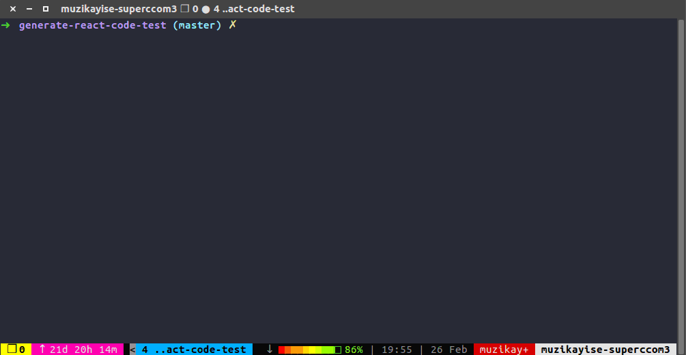
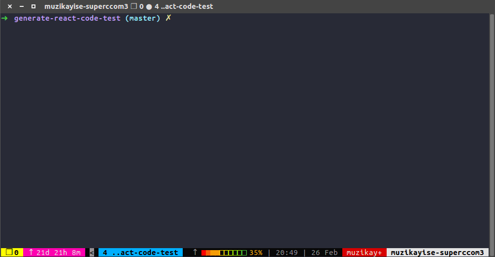
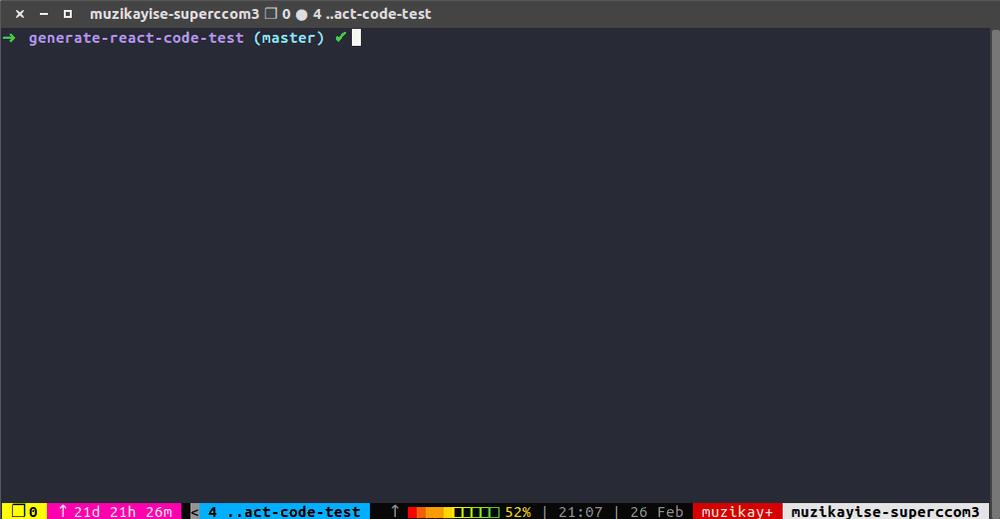
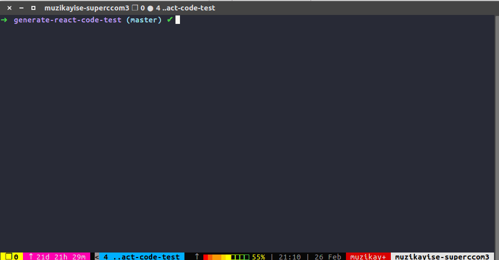
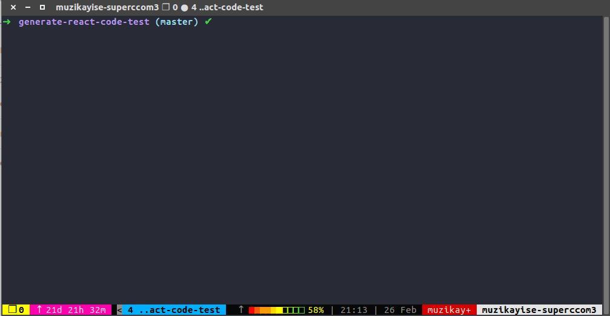
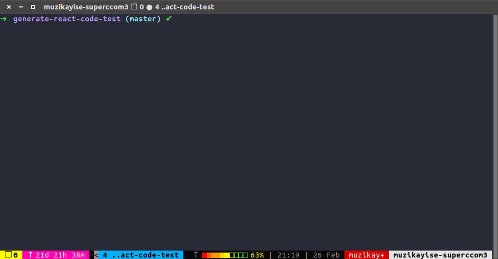

Generate React Code - Test Repo
===============================

## Installation

## Setup in package.json

## Usage
### To generate react component

### To generate react-native compoment

### To generate components without comments

### To generate components with redux code 
*Note: we use duck pattern for redux code*

### To generate redux core files (`store`, `root-reducer`, and `action-creator`)

